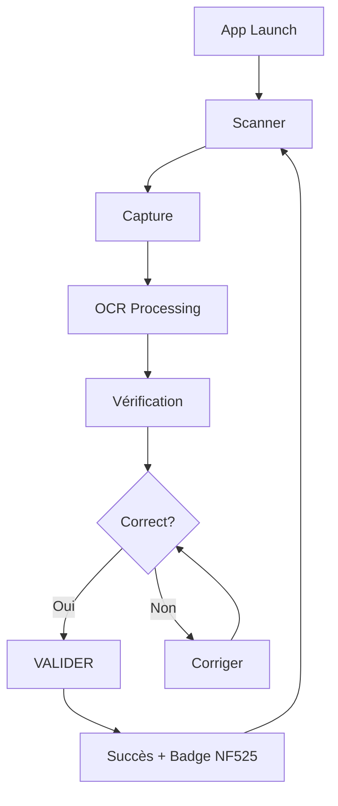
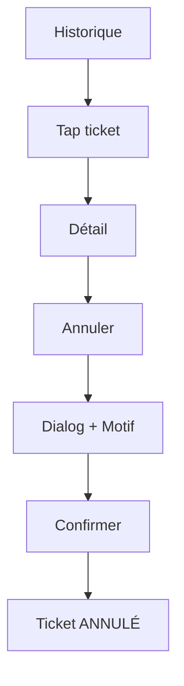

# UX Design Specification - Z-Scanner

**Author:** Stephane
**Date:** 2026-01-15

---

## Executive Summary

### Project Vision

Z-Scanner est une PWA mobile-only permettant aux maraîchers et commerçants ambulants de digitaliser leurs tickets Z de caisse en moins de 2 minutes. L'application combine OCR intelligent et archivage conforme NF525 pour libérer les commerçants de la charge mentale administrative.

### Target Users

**Persona Principal: Jean-Marc, Maraîcher**
- Micro-entrepreneur, 3-4 marchés/semaine en zones rurales
- Smartphone Android standard, pas technophile
- Contexte d'usage : fin de marché, fatigué, pressé, conditions extérieures variables
- Besoin principal : tranquillité d'esprit et conformité fiscale sans effort

**Caractéristiques UX clés:**
- Utilisation une main
- Tolérance zéro pour la complexité
- Besoin de rapidité (<2 min workflow)

### Key Design Challenges

1. **One-handed mobile use** - Zones tactiles 48px+, interface thumb-friendly
2. **Utilisateur non-technophile** - UI évidente, apprentissage zéro
3. **Conditions terrain** - Lisibilité extérieur, grand contraste
4. **Offline obligatoire** - Indicateurs sync clairs, fiabilité totale
5. **Conformité NF525** - Immutabilité perceptible, feedback rassurant

### Design Opportunities

1. **Validation "feel-good"** - Feedback satisfaisant créant soulagement émotionnel
2. **Onboarding zéro-step** - Différenciateur vs apps complexes
3. **Confiance visuelle NF525** - Badge/icône de conformité rassurant

---

## Core User Experience

### Defining Experience

**Core Action:** Scan → Verify → Validate en moins de 2 minutes
**Money Moment:** L'instant où l'utilisateur appuie sur "Valider" et ressent le soulagement de la conformité acquise.

### Platform Strategy

| Aspect | Décision |
|--------|----------|
| Type | PWA (Progressive Web App) |
| Viewport | Mobile-only |
| Interaction | Touch-first, one-handed, thumb zone |
| Offline | 100% fonctionnel |
| Installation | Add to Home Screen, standalone mode |

### Effortless Interactions

- **App launch:** Direct au scanner, pas de menu d'accueil
- **Photo capture:** Un tap, pas de réglages
- **Verification:** Affichage clair, focus sur le total
- **Validation:** 1 bouton, 1 tap, feedback immédiat
- **Sync:** Automatique et transparente

### Critical Success Moments

1. **Premier scan réussi** - Détermine l'adoption
2. **Validation 1-click** - Moment de soulagement émotionnel
3. **Retour après interruption** - Confiance dans le système
4. **Consultation dashboard** - Création de valeur perçue

### Experience Principles

1. **Speed is respect** - Chaque seconde compte
2. **One hand, one tap** - Accessible au pouce
3. **Confidence through feedback** - Actions critiques = feedback visible
4. **Offline is normal** - Jamais de casse sans réseau
5. **Zero learning curve** - Si l'utilisateur réfléchit, on a échoué

---

## Desired Emotional Response

### Primary Emotional Goals

| Émotion | Description | Moment Clé |
|---------|-------------|------------|
| **Soulagement** | Libération de la charge mentale administrative | Validation du ticket |
| **Confiance** | Certitude de conformité NF525 | Badge visible, horodatage |
| **Tranquillité d'esprit** | Zéro stress sur obligations fiscales | Post-validation, sync |
| **Fierté discrète** | Sentiment de professionnalisme | Dashboard mensuel |

### Emotional Journey Mapping

| Stage | Émotion Visée | Contre-émotion à Éviter |
|-------|--------------|-------------------------|
| Découverte | Curiosité → Espoir | Scepticisme |
| Premier scan | Surprise positive | Frustration technique |
| Vérification OCR | Contrôle, Maîtrise | Confusion |
| **Validation** | **SOULAGEMENT** ← Money Moment | Anxiété |
| Post-validation | Satisfaction accomplie | Regret |
| Sync offline→online | Sérénité | Inquiétude |
| Dashboard | Fierté, Valeur perçue | Surcharge info |
| Retour utilisateur | Familiarité, Efficacité | Ré-apprentissage |

### Micro-Emotions

**Priorité Haute:**
- Confiance totale (vs Confusion) - Feedback explicite, états visuels clairs
- Trust immédiat (vs Skepticism) - Badge NF525 visible, horodatage affiché
- Accomplissement rapide (vs Frustration) - Workflow <2min, validation 1-tap

**Priorité Moyenne:**
- Calme efficace (vs Anxiety) - Pas d'animation excessive
- Satisfaction solide (vs simple Delight) - Micro-délices subtils

### Design Implications

| Émotion | Choix UX |
|---------|----------|
| Soulagement | Bouton validation vert massif, checkmark animé + haptic, message "Enregistré et conforme" |
| Confiance | Badge NF525 sur tickets validés, horodatage visible, indicateur sync explicite |
| Tranquillité | Zéro alerte anxiogène, offline = normal, dashboard simple |
| Fierté | Récapitulatif mensuel valorisant, design professionnel accessible |

### Emotional Design Principles

1. **Relief over delight** - Prioriser le soulagement plutôt que l'amusement
2. **Visible proof** - Rendre la conformité tangible (badge, timestamp)
3. **Calm confidence** - Interface sereine qui inspire confiance sans surcharger
4. **Instant closure** - Chaque action donne un feedback définitif
5. **No anxiety triggers** - Éviter tout élément créant doute ou inquiétude

---

## UX Pattern Analysis & Inspiration

### Inspiring Products Analysis

**Revolut**
- Lecture instantanée des transactions
- Catégorisation rapide et gamifiée
- Timeline visuelle claire
- Micro-animations satisfaisantes

**Indy**
- Onboarding progressif et non-intrusif
- Admin rendu confortable
- Confiance par transparence
- Point d'entrée unique (simplicité perçue)

### Transferable UX Patterns

| Catégorie | Pattern | Application Z-Scanner |
|-----------|---------|----------------------|
| Navigation | Bottom-anchored actions | Bouton validation accessible au pouce |
| Navigation | Single-screen focus | Flow linéaire, pas de navigation complexe |
| Interaction | Satisfying micro-interactions | Checkmark animé + haptic sur validation |
| Interaction | Progressive disclosure | Dashboard = découverte, pas obligation |
| Visual | High contrast key data | Montant total = élément le plus visible |
| Visual | Trust indicators | Badge NF525 toujours présent |

### Anti-Patterns to Avoid

- Onboarding multi-écrans → Direct au scanner
- Settings complexes → Defaults intelligents
- Notifications agressives → Silencieux par défaut
- Jargon technique → Langage simple

### Design Inspiration Strategy

**Adopter:** Timeline claire, trust badges, micro-interactions satisfaisantes
**Adapter:** Simplifier vs Revolut (moins de features), focus vs Indy (pas de banking)
**Éviter:** Feature creep, complexité configuration, jargon

---

## Design System Foundation

### Design System Choice

**Choix:** Tailwind CSS + shadcn/ui
**Type:** Themeable System (utility-first + component primitives)

### Rationale for Selection

| Facteur | Décision |
|---------|----------|
| Mobile-first | Tailwind utilities permettent layouts thumb-friendly custom |
| Performance PWA | Pas de runtime CSS, tree-shaking optimal |
| Flexibilité | shadcn/ui = composants copiables, pas de lock-in |
| Accessibilité | Radix UI primitives = ARIA intégré |
| DX Solo Dev | Excellente documentation, large communauté |

### Implementation Approach

**Base Setup:**
- Tailwind CSS 4.x avec nouveau moteur Oxide (performance native)
- Configuration CSS-first via `@theme` (plus de tailwind.config.js)
- shadcn/ui CLI pour scaffolding composants
- Design tokens natifs via CSS variables

**Composants Core à Générer:**
- Button (validation primaire, secondaire)
- Card (ticket display)
- Dialog (confirmation, erreurs)
- Toast (feedback sync, succès)
- Input (correction OCR si nécessaire)

### Customization Strategy

**Design Tokens:**
```css
@theme {
  --color-primary: /* Vert validation */
  --color-trust: /* Bleu NF525 badge */
  --color-danger: /* Rouge annulation */
  --radius-thumb: 12px; /* Coins arrondis touch-friendly */
  --min-touch: 48px; /* Zone tactile minimum */
}
```

**Mobile Overrides:**
- Buttons: min-height 48px, padding généreux
- Touch targets: espacement 8px minimum entre éléments cliquables
- Typography: base 16px (évite zoom iOS)

---

## Defining Experience Details

### The Defining Interaction

> **"Scanne ton ticket Z, valide en 1 tap, c'est conforme."**

Cette phrase capture l'essence de Z-Scanner - la promesse que l'utilisateur peut partager.

### User Mental Model

| Aspect | Modèle Mental |
|--------|--------------|
| Problème actuel | Tickets dans une boîte, risque de perte |
| Attente | Photo = sauvé (comme photo souvenir) |
| Crainte | "Est-ce légalement valide?" |
| Besoin feedback | Voir que c'est enregistré |

**Insight clé:** La photo smartphone = preuve définitive

### Success Criteria

| Critère | Mesure |
|---------|--------|
| "Ça marche" | OCR correct >95% |
| "C'est rapide" | App → Validation < 30s |
| "C'est fait" | Checkmark + "Conforme" visible |
| "C'est sûr" | Badge NF525 + timestamp |
| "Je maîtrise" | Correction possible avant validation |

### Pattern Strategy

**Patterns établis adoptés:**
- Camera capture (banking app style)
- Review before confirm (payment pattern)

**Twist différenciateur:**
- Validation = certification (pas simple sauvegarde)
- Immutabilité visible (badge + horodatage)

### Experience Mechanics Flow

1. **Initiation:** App launch → Caméra directe, zone cadrage visible
2. **Capture:** 1 tap, feedback flash + son, transition vérification
3. **Verification:** Photo + OCR, TOTAL en grand, correction possible
4. **Validation:** Bouton vert thumb-zone, checkmark animé + haptic, "Conforme NF525"
5. **Closure:** Retour caméra automatique, sync background

---

## Visual Design Foundation

### Color System

| Token | Valeur | Usage |
|-------|--------|-------|
| `--primary` | #16A34A | Validation, succès (soulagement) |
| `--trust` | #1D4ED8 | Badge NF525 (confiance) |
| `--background` | #FFFFFF | Fond principal |
| `--surface` | #F8FAFC | Cards, zones |
| `--foreground` | #0F172A | Texte principal |
| `--muted` | #64748B | Texte secondaire |
| `--danger` | #DC2626 | Annulation, erreurs |
| `--warning` | #F59E0B | Sync pending |

**Design Rationale:** Palette high-contrast optimisée usage extérieur, couleurs sémantiques alignées avec objectifs émotionnels (vert=soulagement, bleu=confiance).

### Typography System

**Font:** Inter (system fallback)
**Scale:** 12/14/16/18/20/24/36px
**Hero Element:** Total ticket en 36px (text-4xl)
**Base:** 16px minimum (évite zoom iOS)

### Spacing & Layout Foundation

**Base Unit:** 4px
**Touch Targets:** 48px minimum
**Layout:** Single column, bottom-anchored actions
**Margins:** 16px bords écran

### Accessibility Considerations

- Contraste WCAG AAA (7:1 minimum)
- Touch targets 48x48px
- Focus visible (ring 2px)
- Respect prefers-reduced-motion
- Font 16px minimum

---

## Design Direction Decision

### Design Directions Explored

| Direction | Style | Forces | Faiblesses |
|-----------|-------|--------|------------|
| A: Clean Minimal | Épuré, Apple-like | Élégant, moderne | Peut sembler vide, moins guidant |
| B: Structured Trust | Professionnel, guidé | Badge NF525 visible, guides cadrage | Boutons plus petits |
| C: Bold Action | Immersif, action-first | Bouton massif, contraste | Moins de structure |

### Chosen Direction

**Hybrid B+C: "Structured Trust with Bold Actions"**

Combine les forces de Direction B (structure, confiance) avec l'approche action de Direction C (boutons massifs).

### Design Rationale

| Élément | Choix | Raison |
|---------|-------|--------|
| Header | Badge NF525 visible (B) | Confiance immédiate, différenciateur |
| Cadrage | Guide pointillé (B) | Zero learning curve |
| Boutons | Massifs 64-80px (C) | Thumb-friendly, satisfaisant |
| Layout | Cards structurées (B) | Hiérarchie claire |
| Densité | Aérée avec focus action (B+C) | Lisibilité outdoor |

### Implementation Approach

**Écran Scanner:**
- Header avec logo + badge NF525
- Zone caméra avec guide cadrage pointillé
- Bouton capture massif (64px) en bas

**Écran Vérification:**
- Card avec miniature photo
- Total en hero (36px)
- Champs éditables si correction nécessaire
- Bouton VALIDER massif vert (80px)

**Écran Succès:**
- Checkmark animé central
- Badge NF525 + horodatage
- Retour auto caméra après 2s

---

## User Journey Flows

### Core Scan Flow (J1-J3)

**Path:** App Launch → Scanner → Capture → Verify → Validate → Success
**Target Time:** < 30 secondes
**Taps:** 2 (capture + valider)



**Feedback par étape:**
| Étape | Visuel | Tactile |
|-------|--------|---------|
| Capture | Flash blanc | - |
| Processing | Spinner 1-2s | - |
| Validation | Checkmark animé | Vibration |
| Erreur | Highlight rouge | Vibration warning |

### Annulation Flow (J4)

**Path:** Historique → Ticket → Annuler → Confirmer + Motif → Annulé
**Safeguards:** Dialog confirmation, motif obligatoire, double timestamp



### Historique Flow (J5)

**Path:** Menu → Liste tickets → Filtre optionnel → Détail → Actions
**Features:** Filtre période, vue photo, accès annulation

### Journey Patterns

| Pattern | Usage |
|---------|-------|
| Bottom Action | Actions principales (zone pouce) |
| Confirm Destructive | Annulation (modal + motif) |
| Auto-return | Post-validation (retour caméra 2s) |
| Inline Edit | Correction OCR |

### Flow Optimization Principles

1. **Minimum Viable Taps** - 2 pour core flow
2. **No Dead Ends** - Toujours un chemin suivant
3. **Undo Prevention** - Confirmation destructive uniquement
4. **Progressive Disclosure** - Détails à la demande
5. **Offline Resilience** - Tous flows fonctionnent hors connexion

---

## Component Strategy

### Design System Components (shadcn/ui)

| Composant | Usage |
|-----------|-------|
| Button | Capture, Valider, Annuler |
| Card | Container tickets |
| Dialog | Confirmation annulation |
| Input | Correction OCR |
| Toast | Notifications |
| Badge | Status tickets |

### Custom Components

#### CameraView
Écran scanner avec video stream et guide cadrage pointillé.
States: idle, capturing, processing

#### TicketCard
Affichage ticket avec miniature photo, total hero, status et badge NF525.
Variants: compact (liste), detailed (vue)

#### NF525Badge
Badge conformité avec icône bouclier et timestamp cryptographique.

#### ValidationSuccess
Animation Money Moment: checkmark animé + haptic + message "Conforme".
Auto-return après 2s.

#### SyncIndicator
Indicateur discret: synced, pending(n), offline.

### Implementation Roadmap

| Phase | Composants |
|-------|------------|
| P1 Core | CameraView, ValidationSuccess |
| P2 Data | TicketCard, NF525Badge |
| P3 Infra | SyncIndicator, Toast |

---

## UX Consistency Patterns

### Button Hierarchy

| Type | Usage | Style |
|------|-------|-------|
| Primary | Valider, Scanner | Vert plein, 64-80px |
| Secondary | Navigation | Outline, 48px |
| Destructive | Annuler | Rouge outline, 48px |
| Ghost | Tertiaire | Texte seul, 44px |

**Règle:** 1 Primary par écran, toujours en thumb zone.

### Feedback Patterns

| État | Feedback |
|------|----------|
| Success | Checkmark animé + vibration + "Conforme" (2s) |
| Error | Shake + vibration double + message persist |
| Warning | Orange + message |
| Loading | Spinner (pas de texte si < 2s) |

### Form Patterns

- Labels au-dessus (jamais placeholder-only)
- Validation inline immédiate
- Erreurs en rouge sous le champ

### Navigation Patterns

- Linear flow principal (pas de menu complexe)
- Auto-return post-validation (2s)
- Back via chevron haut-gauche
- Bottom sheet pour détails

### States Patterns

- Empty: Illustration + message simple
- Offline: Icône header + toast unique
- Loading: Spinner centré

---

## Responsive Design & Accessibility

### Responsive Strategy

**Approche:** Mobile-first, UI identique tous devices

| Device | Stratégie |
|--------|-----------|
| Desktop | UI mobile (centré ou max-width) |
| Tablet | UI mobile |
| Mobile | Cible principale |

| Breakpoint | Largeur |
|------------|---------|
| Small | 320-374px |
| Standard | 375-413px |
| Large | 414px+ |

### Accessibility Strategy

**Niveau:** WCAG 2.1 AA (AAA pour contraste outdoor)

| Critère | Implémentation |
|---------|----------------|
| Contraste | 7:1 (AAA) |
| Touch targets | 48px minimum |
| Focus | Ring 2px visible |
| Motion | prefers-reduced-motion |
| Font | 16px minimum |

### Testing Strategy

**Devices:** Android budget/mid, iPhone SE+
**Tests:** axe-core, Lighthouse, VoiceOver/TalkBack, terrain réel

### Implementation Guidelines

- Semantic HTML + ARIA labels
- Focus management dans modals
- touch-action: manipulation
- Haptic feedback (Vibration API)
